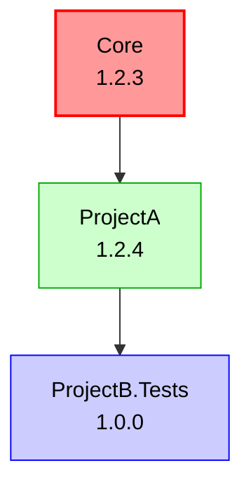
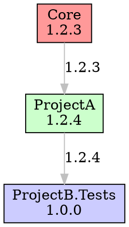

# Mister.Version


A sophisticated automatic versioning system for .NET monorepos built on MSBuild with enhanced support for development workflows and feature branches. Mister.Version (MR Version → MonoRepo Version) provides intelligent, change-based versioning that increases version numbers only when actual changes are detected in a project or its dependencies.

## ✨ What's New in v3.0.0

- **📅 Calendar Versioning (CalVer) Support**: Use date-based versioning (e.g., 2025.11.0) as an alternative to SemVer. Supports YYYY.MM.PATCH, YY.0M.PATCH, YYYY.WW.PATCH formats. Perfect for time-based releases!
- **📋 Version Policies (Lock-Step & Grouped)**: Coordinate versions across projects with lock-step, grouped, or independent versioning strategies
- **🎯 Conventional Commits Support**: Automatic semantic version bump detection based on commit message conventions (BREAKING CHANGE → major, feat → minor, fix → patch)
- **📝 Automatic Changelog Generation**: Generate beautiful changelogs from commit history in Markdown, Plain Text, or JSON formats
- **🔧 Git Integration Enhancements**: Shallow clone support, custom tag patterns, submodule detection, branch metadata, and tag ancestry validation
- **📂 File Pattern-Based Change Detection**: Smart versioning based on which files changed (major/minor/patch patterns)
- **📁 Additional Directory Monitoring**: Monitor shared directories and external modules for changes that trigger version bumps
- **🏗️ Refactored Architecture**: Shared core library between MSBuild task and CLI tool
- **🔧 Dev Branch Support**: Development branches now increment patch versions like main branches
- **📊 Enhanced Feature Branches**: Feature branches include commit height in versioning (e.g., `v3.0.4-feature.1-{git-hash}`)
- **📄 JSON Reporting**: Full JSON report generation capability
- **🎯 Improved Change Detection**: Better detection of dependency changes and package updates
- **🧪 Enhanced Testing**: Comprehensive test coverage for core functionality
- **📊 Dependency Graph Visualization**: Generate visual dependency graphs in Mermaid, DOT, and ASCII formats

## Architecture

The solution is now structured with a shared core library:

```
Mister.Version.Core/          # Shared versioning logic
├── Models/                   # Data models and enums
├── Services/                 # Core services (Git, Versioning, Reporting)
└── Mister.Version.Core.csproj

Mister.Version/               # MSBuild task
├── MonoRepoVersionTask.cs    # MSBuild integration
└── Mister.Version.csproj

Mister.Version.CLI/           # Command-line tool
├── Program.cs                # CLI interface
└── Mister.Version.CLI.csproj
```

## Features

- **Calendar Versioning (CalVer) Support**: 📅 **NEW** - Date-based versioning alternative to SemVer with multiple format options
- **Version Policies**: 📋 **NEW** - Lock-step, grouped, or independent versioning strategies for coordinating project releases
- **Conventional Commits Support**: 🎯 **NEW** - Intelligent semantic versioning based on commit message conventions
- **Automatic Changelog Generation**: 📝 **NEW** - Generate changelogs automatically from conventional commits
- **File Pattern-Based Change Detection**: 📂 **NEW** - Smart versioning based on which files changed (ignore docs, force major for public API changes)
- **Change-Based Versioning**: Version numbers only increment when actual code changes are detected
- **Dependency-Aware**: Automatically bumps versions when dependencies change
- **Enhanced Branch Support**: Different versioning strategies for main, dev, release, and feature branches
- **Feature Branch Commit Height**: Feature branches include commit count for better traceability
- **Package Lock Detection**: Detects changes in dependencies via packages.lock.json
- **Project Type Filtering**: Skip versioning for test projects and non-packable projects
- **Multiple Output Formats**: Text, JSON, CSV, and dependency graph reporting
- **MSBuild Integration**: Seamlessly integrates with your build process
- **Zero-Commit Approach**: No need to commit version changes to your repo
- **Customizable**: Extensive configuration options

## How It Works

MonoRepo Versioning uses Git history to intelligently determine when to increment versions. At build time, it:

1. Identifies the current branch type (main, dev, release, feature)
2. Determines the base version from tags and branch context
3. Checks for changes in the project and its dependencies
4. Applies appropriate versioning rules based on context
5. Injects the calculated version into MSBuild properties

### Enhanced Versioning Rules

- **Main Branch**: Commits to main increment the patch version by default (8.2.0 → 8.2.1)
  - With conventional commits enabled: Analyzes commit messages to determine bump type
- **Dev Branch**: ✨ **NEW** - Dev branches also increment patch versions (8.2.0 → 8.2.1)
  - With conventional commits enabled: Analyzes commit messages to determine bump type
- **Release Branches**: Patch increments for changes in the branch (7.3.0 → 7.3.2)
- **Feature Branches**: ✨ **ENHANCED** - Include commit height and hash (8.2.0-feature-name.3-abc1234)

### Conventional Commits for Semantic Versioning

✨ **NEW** - Mister.Version now supports automatic semantic version bump detection based on commit message conventions. When enabled, it analyzes commit messages to intelligently determine whether to bump major, minor, or patch versions.

#### How It Works

When conventional commits are enabled, the tool analyzes commit messages since the last version tag:

```bash
# These commits trigger MAJOR version bumps (1.0.0 → 2.0.0)
git commit -m "feat!: remove deprecated API"
git commit -m "fix: resolve bug

BREAKING CHANGE: The authentication flow has changed."

# These commits trigger MINOR version bumps (1.0.0 → 1.1.0)
git commit -m "feat: add new dashboard feature"
git commit -m "feature: implement user profiles"

# These commits trigger PATCH version bumps (1.0.0 → 1.0.1)
git commit -m "fix: resolve login bug"
git commit -m "bugfix: patch security issue"
git commit -m "perf: optimize database queries"
git commit -m "refactor: clean up authentication code"

# These commits are IGNORED for versioning
git commit -m "chore: update dependencies"
git commit -m "docs: update README"
git commit -m "style: format code"
git commit -m "test: add unit tests"
git commit -m "ci: update pipeline"
```

#### Commit Message Format

The tool supports the Angular conventional commits specification:

```
<type>[optional scope][optional !]: <description>

[optional body]

[optional footer(s)]
```

**Examples:**
- `feat: add user authentication` → Minor version bump
- `feat(api): add pagination support` → Minor version bump (with scope)
- `fix: resolve memory leak` → Patch version bump
- `feat!: redesign API` → Major version bump (breaking change indicator)
- `fix: resolve bug\n\nBREAKING CHANGE: API changed` → Major version bump (breaking change footer)

#### Default Patterns

| Bump Type | Default Patterns | Example |
|-----------|-----------------|---------|
| **Major** | `BREAKING CHANGE:`, `!:` | `feat!: remove old API` |
| **Minor** | `feat:`, `feature:` | `feat: add dashboard` |
| **Patch** | `fix:`, `bugfix:`, `perf:`, `refactor:` | `fix: resolve bug` |
| **None** | `chore:`, `docs:`, `style:`, `test:`, `ci:` | `chore: update deps` |

#### Priority Rules

When multiple commits exist, the highest priority bump type wins:
1. **Major** (breaking changes) takes precedence over everything
2. **Minor** (features) takes precedence over patch
3. **Patch** (fixes) is the baseline
4. **None** (ignored commits) doesn't affect versioning

**Example:** If you have commits `fix: bug`, `feat: feature`, and `feat!: breaking`, the result is a **major** version bump.

#### CLI Output

The CLI tool shows detailed analysis when conventional commits are enabled:

```bash
$ mr-version version -p src/MyProject/MyProject.csproj -d

Version: 2.0.0
Previous Version: 1.2.3
Version Changed: Yes
Change Reason: Main branch: Incrementing major version (breaking change detected)

Conventional Commits Analysis: Enabled
Detected Bump Type: Major

Analyzed Commits:
  Major (1):
    - abc1234: feat!: redesign authentication API
      Breaking change detected (! indicator)

  Minor (2):
    - def5678: feat: add user profiles
    - ghi9012: feature: implement dashboard

  Patch (3):
    - jkl3456: fix: resolve login bug
    - mno7890: perf: optimize queries
    - pqr1234: refactor: clean up code

  Ignored (2):
    - stu5678: chore: update dependencies
    - vwx9012: docs: update README
```

### File Pattern-Based Change Detection

✨ **NEW** - Control version bumps based on which files changed. Perfect for ignoring documentation-only changes or forcing major bumps for public API changes.

#### How It Works

When file pattern detection is enabled, Mister.Version analyzes changed files and applies significance rules:

```bash
# Documentation-only changes - NO version bump
# Changed: README.md, docs/guide.md
dotnet build
# Result: No version bump (files matched ignore patterns)

# Public API changes - MAJOR version bump
# Changed: src/PublicApi/IUserService.cs
dotnet build
# Result: Major bump 2.0.0 → 3.0.0 (even if commit says "fix:")

# Feature file changes - MINOR version bump
# Changed: src/Features/Authentication.cs
dotnet build
# Result: Minor bump 2.0.0 → 2.1.0

# Combined with conventional commits (takes highest)
# Commit: fix: resolve bug (patch)
# Changed: src/PublicApi/IService.cs (major pattern)
# Result: MAJOR bump (file pattern overrides commit message)
```

#### Configuration

**Via MSBuild:**

```xml
<PropertyGroup>
  <!-- Enable file pattern-based change detection -->
  <MonoRepoChangeDetectionEnabled>true</MonoRepoChangeDetectionEnabled>

  <!-- Ignore documentation changes (won't trigger version bumps) -->
  <MonoRepoIgnoreFilePatterns>**/*.md;**/docs/**;**/*.txt;**/.editorconfig</MonoRepoIgnoreFilePatterns>

  <!-- Force major version for public API changes -->
  <MonoRepoMajorFilePatterns>**/PublicApi/**;**/Contracts/**;**/Interfaces/**</MonoRepoMajorFilePatterns>

  <!-- Force minor version for new features -->
  <MonoRepoMinorFilePatterns>**/Features/**</MonoRepoMinorFilePatterns>

  <!-- Force patch version for internal changes -->
  <MonoRepoPatchFilePatterns>**/Internal/**;**/Utils/**</MonoRepoPatchFilePatterns>

  <!-- Source-only mode: ignore all non-source changes -->
  <MonoRepoSourceOnlyMode>false</MonoRepoSourceOnlyMode>
</PropertyGroup>
```

**Via YAML:**

```yaml
changeDetection:
  enabled: true

  # Ignore patterns (won't trigger version bumps)
  ignorePatterns:
    - "**/*.md"           # All markdown files
    - "**/docs/**"        # Documentation folder
    - "**/*.txt"          # Text files
    - "**/.editorconfig"  # Editor config
    - "**/.gitignore"     # Git ignore files

  # Major version patterns (breaking changes)
  majorPatterns:
    - "**/PublicApi/**"   # Public API folder
    - "**/Contracts/**"   # Contract definitions
    - "**/Interfaces/**"  # Public interfaces

  # Minor version patterns (new features)
  minorPatterns:
    - "**/Features/**"    # New features

  # Patch version patterns (bug fixes)
  patchPatterns:
    - "**/Internal/**"    # Internal code
    - "**/Utils/**"       # Utility code

  # Source-only mode
  sourceOnlyMode: false
```

#### Pattern Syntax

Supports glob patterns with these wildcards:

| Pattern | Description | Example Matches |
|---------|-------------|-----------------|
| `*` | Matches any characters except `/` | `*.md` matches `README.md` |
| `**` | Matches any number of directories | `**/docs/**` matches `src/docs/api.md` |
| `?` | Matches any single character | `test.??` matches `test.cs` |

#### Pattern Priority Rules

1. **Ignore patterns** are evaluated first (highest priority)
2. **Major patterns** take precedence over minor/patch
3. **Minor patterns** take precedence over patch
4. **Patch patterns** are the baseline
5. **Unclassified files** default to patch (or `MinimumBumpType` if configured)

**Example:**

```
Changed files:
- README.md              → Ignored (matches **/*.md)
- src/PublicApi/IFoo.cs  → Major (matches **/PublicApi/**)
- src/Features/Bar.cs    → Minor (matches **/Features/**)
- src/Internal/Baz.cs    → Patch (matches **/Internal/**)

Result: MAJOR version bump (highest priority wins)
```

#### Integration with Conventional Commits

When both conventional commits AND file pattern detection are enabled, **both are analyzed** and the **higher bump type wins**:

```
Scenario 1:
  Commit: chore: update (ignored)
  Files: src/Features/Auth.cs (minor pattern)
  Result: MINOR bump

Scenario 2:
  Commit: feat: add feature (minor)
  Files: src/PublicApi/IService.cs (major pattern)
  Result: MAJOR bump

Scenario 3:
  Commit: fix: resolve bug (patch)
  Files: README.md (ignored)
  Result: PATCH bump

Scenario 4:
  Commit: docs: update (ignored)
  Files: docs/guide.md (ignored)
  Result: NO version bump
```

#### Source-Only Mode

Enable `SourceOnlyMode` to ignore ALL documentation, test, and configuration changes:

```xml
<MonoRepoSourceOnlyMode>true</MonoRepoSourceOnlyMode>
```

In this mode:
- Only changes to files NOT matching ignore patterns will trigger version bumps
- Perfect for libraries where docs/tests don't warrant new versions
- Combine with ignore patterns for fine-grained control

#### Additional Directory Monitoring

Monitor changes in directories outside your project directory. This is useful when your project depends on shared libraries, common utilities, or external modules that should trigger version bumps.

**Use Cases:**
- Shared code libraries used by multiple projects
- Common utilities or helper directories
- External modules included in your build
- Monorepo shared resources

**Via MSBuild:**

```xml
<PropertyGroup>
  <!-- Monitor additional directories for changes -->
  <MonoRepoAdditionalMonitorPaths>../shared/common;../libs/core;/absolute/path/to/utils</MonoRepoAdditionalMonitorPaths>

  <!-- These paths respect file pattern rules -->
  <MonoRepoIgnoreFilePatterns>**/*.md;**/docs/**</MonoRepoIgnoreFilePatterns>
  <MonoRepoMajorFilePatterns>**/PublicApi/**</MonoRepoMajorFilePatterns>
</PropertyGroup>
```

**Via YAML (per-project):**

```yaml
projects:
  MyApi:
    # Project-specific additional paths
    additionalMonitorPaths:
      - "../shared/common"
      - "../libs/authentication"
      - "/absolute/path/to/contracts"

  MyWeb:
    # Different paths for different projects
    additionalMonitorPaths:
      - "../shared/frontend"
      - "../libs/ui-components"
```

**How It Works:**

1. Changes in additional directories are detected alongside project changes
2. File pattern rules (major/minor/patch/ignore) apply to additional paths
3. Both absolute and relative paths are supported
4. Paths are relative to repository root when using relative paths
5. Multiple paths can be specified (semicolon-separated in MSBuild, list in YAML)

**Example:**

```bash
# Project structure:
# /monorepo
#   /projects
#     /MyApi        (monitors /shared/common)
#   /shared
#     /common       (contains shared utilities)

# Change shared/common/Utils.cs
cd /monorepo/projects/MyApi
dotnet build

# Result: MyApi version bumps because shared/common changed
# If Utils.cs matches majorPatterns → MAJOR bump
# If Utils.cs matches minorPatterns → MINOR bump
# Otherwise → PATCH bump (or ignored if matches ignorePatterns)
```

**Configuration Priority:**

When both MSBuild properties and YAML config specify additional paths:
1. YAML project-specific paths are loaded
2. MSBuild property paths are added/merged
3. Duplicates are automatically removed

### Git Integration Enhancements

Mister.Version includes advanced Git repository integration features to handle various repository scenarios.

#### Shallow Clone Support

Works seamlessly with repositories cloned using `git clone --depth N`:

```xml
<PropertyGroup>
  <!-- Enabled by default -->
  <MonoRepoShallowCloneSupport>true</MonoRepoShallowCloneSupport>

  <!-- Optional: Fallback version when history is unavailable -->
  <MonoRepoShallowCloneFallbackVersion>1.0.0</MonoRepoShallowCloneFallbackVersion>
</PropertyGroup>
```

Features:
- Automatically detects shallow clones
- Logs warnings when version history is limited
- Uses fallback version when tags aren't available
- Perfect for CI/CD pipelines with shallow checkouts

#### Custom Tag Patterns

Define custom tag naming conventions per project:

```xml
<PropertyGroup>
  <!-- Format: ProjectName={name}-{prefix}{version} -->
  <MonoRepoCustomTagPatterns>
    MyLib={name}_{prefix}{version};
    MyApp={name}/{prefix}{version}
  </MonoRepoCustomTagPatterns>
</PropertyGroup>
```

Supported placeholders:
- `{name}`: Project name
- `{prefix}`: Tag prefix (e.g., "v")
- `{version}`: Semantic version

#### Submodule Change Detection

Track changes in Git submodules:

```xml
<PropertyGroup>
  <MonoRepoSubmoduleSupport>true</MonoRepoSubmoduleSupport>
</PropertyGroup>
```

Monitors:
- `.gitmodules` file changes
- Submodule pointer updates (gitlink changes)
- Triggers version bumps when submodules are updated

#### Branch Metadata in Versions

Include branch names in version build metadata:

```xml
<PropertyGroup>
  <MonoRepoIncludeBranchInMetadata>true</MonoRepoIncludeBranchInMetadata>
</PropertyGroup>
```

Example outputs:
- `1.2.3+auth-feature` (on feature/auth-feature branch)
- `1.2.3+bugfix-login` (on bugfix/login-issue branch)
- `1.2.3` (on main/master - no metadata added)

Branch names are sanitized:
- Common prefixes removed (feature/, hotfix/, bugfix/)
- Invalid characters replaced with hyphens
- Truncated to 20 characters max

#### Tag Ancestry Validation

Ensure version tags are reachable from current branch:

```xml
<PropertyGroup>
  <!-- Enabled by default -->
  <MonoRepoValidateTagAncestry>true</MonoRepoValidateTagAncestry>
</PropertyGroup>
```

Benefits:
- Filters out tags not in current branch's history
- Prevents using versions from unmerged branches
- Automatically disabled for shallow clones
- Ensures accurate version calculation

### Feature Branch Versioning

Feature branches now use a more sophisticated versioning scheme:

```
Format: {base-version}-{branch-name}.{commit-height}-{git-hash}
Example: v3.0.4-feature.1-abc1234
```

Where:
- `3.0.4` is the base version from the last tag
- `feature` is the normalized branch name
- `1` is the number of commits since the base tag
- `abc1234` is the short Git hash

## Getting Started

### Prerequisites

- .NET SDK 6.0+ (supports both .NET Framework 4.7.2 and .NET 8.0)
- Git installed and accessible in PATH
- A .NET solution using MSBuild

### Installation

#### Option 1: NuGet Package

```bash
dotnet add package Mister.Version --version 3.0.0
```

#### Option 2: CLI Tool

```bash
dotnet tool install --global Mister.Version.CLI --version 3.0.0
```

### Basic Setup

1. Add the targets file reference to each project that should use automatic versioning:

```xml
<Import Project="$(MSBuildThisFileDirectory)..\..\build\Mister.Version.targets" />
```

2. Create an initial version tag for your repository:

```bash
git tag v1.0.0
```

3. Build your solution:

```bash
dotnet build
```

The tool will automatically calculate and apply versions to your assemblies and packages.

### Quick Start: Enable Conventional Commits

To enable automatic semantic versioning based on commit messages:

1. Add to your project file or Directory.Build.props:

```xml
<PropertyGroup>
  <MonoRepoConventionalCommitsEnabled>true</MonoRepoConventionalCommitsEnabled>
</PropertyGroup>
```

2. Use conventional commit messages:

```bash
# Minor version bump (new feature)
git commit -m "feat: add user authentication"

# Patch version bump (bug fix)
git commit -m "fix: resolve login issue"

# Major version bump (breaking change)
git commit -m "feat!: redesign API"
```

3. Build and see semantic versioning in action:

```bash
dotnet build
```

The version will be automatically incremented based on your commit types!

## CLI Usage

The CLI tool provides comprehensive reporting and single-project version calculation:

### Generate Version Report

```bash
# Generate a text report
mr-version report

# Generate JSON report
mr-version report -o json -f versions.json

# Include test projects and detailed info
mr-version report --include-test-projects --include-commits

# Generate CSV for analysis
mr-version report -o csv -f report.csv

# Generate dependency graph
mr-version report -o graph

# Generate Mermaid graph for GitHub
mr-version report -o graph --graph-format mermaid

# Generate DOT graph for Graphviz
mr-version report -o graph --graph-format dot -f dependencies.dot

# Generate ASCII tree in console
mr-version report -o graph --graph-format ascii

# Show only changed projects in graph
mr-version report -o graph --changed-only
```

#### CLI Options

| Option | Description | Default |
|--------|-------------|---------|
| `-r, --repo` | Repository root path | Current directory |
| `-p, --project-dir` | Projects directory | Repository root |
| `-o, --output` | Output format (text, json, csv, graph) | `text` |
| `-f, --file` | Output file path | Console |
| `-b, --branch` | Branch to analyze | Current branch |
| `--include-commits` | Include commit information | `true` |
| `--include-dependencies` | Include dependency information | `true` |
| `--include-test-projects` | Include test projects | `false` |
| `--include-non-packable` | Include non-packable projects | `false` |
| `--graph-format` | Graph format (mermaid, dot, ascii) | `mermaid` |
| `--show-versions` | Show version numbers in graph nodes | `true` |
| `--changed-only` | Show only projects with changes | `false` |

### Calculate Single Project Version

```bash
# Get version for specific project
mr-version version -p src/MyProject/MyProject.csproj

# Detailed output with reasoning
mr-version version -p src/MyProject/MyProject.csproj -d

# JSON output for automation
mr-version version -p src/MyProject/MyProject.csproj -j
```

### Generate Changelog

✨ **NEW** - Automatically generate changelogs from conventional commits:

```bash
# Generate changelog from last tag to HEAD
mr-version changelog

# Generate for specific version range
mr-version changelog --from 2.2.0 --to 2.3.0

# Output to file
mr-version changelog --output-file CHANGELOG.md

# Different output formats
mr-version changelog --output markdown  # Default, GitHub-friendly
mr-version changelog --output text      # Plain text
mr-version changelog --output json      # Structured JSON

# With repository URL for clickable links
mr-version changelog --repo-url https://github.com/owner/repo

# Customize output
mr-version changelog --include-authors --include-commits --include-issues

# For monorepo - specify project
mr-version changelog --project MyProject
```

#### Changelog CLI Options

| Option | Description | Default |
|--------|-------------|---------|
| `-r, --repo` | Repository root path | Current directory |
| `-p, --project` | Project name for monorepo | None |
| `-f, --from` | Start version tag | Previous tag |
| `-t, --to` | End version tag | HEAD |
| `-o, --output` | Output format (markdown, text, json) | `markdown` |
| `--output-file` | Output file path | Console |
| `--repo-url` | Repository URL for links | None |
| `--include-authors` | Include commit authors | `false` |
| `--include-commits` | Include commit links | `true` |
| `--include-issues` | Include issue references | `true` |
| `--include-prs` | Include PR references | `true` |
| `--group-breaking` | Group breaking changes separately | `true` |

#### Example Changelog Output

**Markdown format:**

```markdown
## v2.3.0 (2025-11-20)

**Minor release** - 15 commit(s) by 4 contributor(s)

### 💥 Breaking Changes

- **api:** remove deprecated endpoints [#42](https://github.com/owner/repo/issues/42) ([abc1234](https://github.com/owner/repo/commit/abc1234))
  > ⚠️ **BREAKING:** The /v1/users endpoint has been removed. Use /v2/users instead.

### 🚀 Features

- **core:** add conventional commits support ([def5678](https://github.com/owner/repo/commit/def5678))
- **cli:** add changelog generation (#45) ([ghi9012](https://github.com/owner/repo/commit/ghi9012))
- **msbuild:** add version bump detection ([jkl3456](https://github.com/owner/repo/commit/jkl3456))

### 🐛 Bug Fixes

- **git:** resolve memory leak in git service #43 ([mno7890](https://github.com/owner/repo/commit/mno7890))
- **cli:** fix JSON output formatting ([pqr1234](https://github.com/owner/repo/commit/pqr1234))

### ⚡ Performance

- **core:** optimize commit analysis ([stu5678](https://github.com/owner/repo/commit/stu5678))

### 📝 Documentation

- update README with new features ([vwx9012](https://github.com/owner/repo/commit/vwx9012))
```

**JSON format:**

```json
{
  "version": "2.3.0",
  "previousVersion": "2.2.0",
  "date": "2025-11-20T10:30:00Z",
  "projectName": null,
  "totalCommits": 15,
  "contributorCount": 4,
  "contributors": ["Alice", "Bob", "Charlie", "Diana"],
  "bumpType": "Minor",
  "sections": [
    {
      "title": "Breaking Changes",
      "emoji": "💥",
      "order": 1,
      "entries": [
        {
          "commitSha": "abc1234",
          "type": "feat",
          "scope": "api",
          "description": "remove deprecated endpoints",
          "isBreakingChange": true,
          "breakingChangeDescription": "The /v1/users endpoint has been removed",
          "issueReferences": ["42"],
          "bumpType": "Major"
        }
      ]
    }
  ]
}
```

**Plain text format:**

```
v2.3.0 (2025-11-20)
============================================================

MINOR release - 15 commit(s) by 4 contributor(s)

Breaking Changes
----------------

  * [api] remove deprecated endpoints (#42) (abc1234)
    WARNING: The /v1/users endpoint has been removed. Use /v2/users instead.

Features
--------

  * [core] add conventional commits support (def5678)
  * [cli] add changelog generation (#45) (ghi9012)
  * [msbuild] add version bump detection (jkl3456)

Bug Fixes
---------

  * [git] resolve memory leak in git service (#43) (mno7890)
  * [cli] fix JSON output formatting (pqr1234)
```

## Calendar Versioning (CalVer) Support

📅 **NEW in v3.0** - Mister.Version now supports Calendar Versioning (CalVer) as an alternative to Semantic Versioning (SemVer). CalVer is a date-based versioning scheme commonly used by projects like Ubuntu, Windows, and many others.

### What is CalVer?

Calendar Versioning uses date-based version numbers instead of arbitrary increments. For example:
- `2025.11.0` - Released in November 2025 (first release)
- `2025.11.5` - Released in November 2025 (sixth release)

### Supported CalVer Formats

Mister.Version supports four CalVer formats:

| Format | Description | Example | Use Case |
|--------|-------------|---------|----------|
| `YYYY.MM.PATCH` | Full year, month, patch | `2025.11.0` | Ubuntu-style releases |
| `YY.0M.PATCH` | Short year, zero-padded month, patch | `25.11.0` | Compact year format |
| `YYYY.WW.PATCH` | Full year, ISO week number, patch | `2025.47.0` | Weekly release cadence |
| `YYYY.0M.PATCH` | Full year, zero-padded month, patch | `2025.11.0` | Alternative month format |

### How CalVer Works

When CalVer is enabled:
1. **Major** version = Year or short year (e.g., 2025 or 25)
2. **Minor** version = Month (1-12) or ISO week number (1-53)
3. **Patch** version = Incremental counter (0, 1, 2, ...)

The patch version increments for each release within the same period (month/week):
- Same month/week: Patch increments (e.g., `2025.11.0` → `2025.11.1`)
- New month/week: Patch resets to 0 (e.g., `2025.11.5` → `2025.12.0`)

### Configuration

#### MSBuild Configuration

Add these properties to your project file or `Directory.Build.props`:

```xml
<PropertyGroup>
  <!-- Enable CalVer -->
  <MonoRepoVersionScheme>CalVer</MonoRepoVersionScheme>

  <!-- Choose format -->
  <MonoRepoCalVerFormat>YYYY.MM.PATCH</MonoRepoCalVerFormat>

  <!-- Optional: Reset patch version each period (default: true) -->
  <MonoRepoCalVerResetPatch>true</MonoRepoCalVerResetPatch>

  <!-- Optional: Custom separator (default: ".") -->
  <MonoRepoCalVerSeparator>.</MonoRepoCalVerSeparator>
</PropertyGroup>
```

#### YAML Configuration

Add CalVer configuration to your `mr-version.yml`:

```yaml
# Enable CalVer versioning scheme
versionScheme: calver  # or semver (default)

# CalVer configuration
calver:
  format: "YYYY.MM.PATCH"  # Options: YYYY.MM.PATCH, YY.0M.PATCH, YYYY.WW.PATCH, YYYY.0M.PATCH
  resetPatchPeriodically: true  # Reset patch to 0 each month/week
  separator: "."  # Version separator
  startDate: "2025-01-01"  # Optional: Starting date for versioning

# Project-specific CalVer overrides
projects:
  MyProject:
    versionScheme: calver
    calver:
      format: "YY.0M.PATCH"
      resetPatchPeriodically: true
```

### CLI Usage

#### Calculate CalVer Version

```bash
# Use CalVer format from configuration
mr-version version --project MyProject/MyProject.csproj

# View detailed CalVer information
mr-version version --project MyProject/MyProject.csproj --detailed
```

**Sample Output (with `--detailed`):**

```
Project: MyProject
Version: 2025.11.2
Changed: Yes
Reason: CalVer - Changes detected in project (patch increment)
Branch: main (Main)
Scheme: CalVer
CalVer Format: YYYY.MM.PATCH
CalVer Reset Patch: True
```

#### JSON Output

```bash
mr-version version --project MyProject/MyProject.csproj --json
```

```json
{
  "project": "MyProject",
  "version": "2025.11.2",
  "versionChanged": true,
  "changeReason": "CalVer - Changes detected in project (patch increment)",
  "scheme": "CalVer",
  "calver": {
    "format": "YYYY.MM.PATCH",
    "startDate": null,
    "resetPatchPeriodically": true,
    "separator": "."
  }
}
```

### CalVer with Prereleases

CalVer works seamlessly with prerelease versions:

```xml
<PropertyGroup>
  <MonoRepoVersionScheme>CalVer</MonoRepoVersionScheme>
  <MonoRepoCalVerFormat>YYYY.MM.PATCH</MonoRepoCalVerFormat>
  <MonoRepoPrereleaseType>alpha</MonoRepoPrereleaseType>
</PropertyGroup>
```

**Result:** `2025.11.0-alpha`

### CalVer with Build Metadata

Include branch names in version metadata for feature branches:

```xml
<PropertyGroup>
  <MonoRepoVersionScheme>CalVer</MonoRepoVersionScheme>
  <MonoRepoCalVerFormat>YYYY.MM.PATCH</MonoRepoCalVerFormat>
  <MonoRepoIncludeBranchInMetadata>true</MonoRepoIncludeBranchInMetadata>
</PropertyGroup>
```

**Result on feature branch:** `2025.11.2+feature-calver-support`

### Use Cases for CalVer

CalVer is ideal for projects with:
- **Time-based releases**: Monthly or weekly release schedules
- **Long-term support**: Clear indication of when versions were released
- **Marketing alignment**: Version numbers that match release dates
- **Operating systems**: Following Ubuntu's model (e.g., 22.04 for April 2022)
- **Tools and utilities**: Where release date is more meaningful than feature changes

### CalVer vs SemVer

| Aspect | CalVer | SemVer |
|--------|---------|---------|
| **Version format** | Date-based (2025.11.0) | Feature-based (3.0.0) |
| **Breaking changes** | Not explicitly indicated | Major version bump |
| **Release timing** | Tied to calendar | Independent of calendar |
| **Best for** | Time-based releases | Feature-driven releases |
| **Examples** | Ubuntu, Windows 10 | Most libraries/frameworks |

You can use either scheme in the same repository - configure CalVer per-project in your `mr-version.yml`!

### Examples

#### Ubuntu-Style Releases

```yaml
versionScheme: calver
calver:
  format: "YYYY.MM.PATCH"
  resetPatchPeriodically: true
```

**Versions:** `2025.04.0` (April 2025 LTS), `2025.10.0` (October 2025)

#### Week-Based Releases

```yaml
versionScheme: calver
calver:
  format: "YYYY.WW.PATCH"
  resetPatchPeriodically: true
```

**Versions:** `2025.01.0` (Week 1), `2025.47.2` (Week 47, third release)

#### Compact Year Format

```yaml
versionScheme: calver
calver:
  format: "YY.0M.PATCH"
  resetPatchPeriodically: true
```

**Versions:** `25.11.0`, `25.12.5`

## Report Formats

### Dependency Graph Visualization

MonoRepo Versioning can generate visual dependency graphs in multiple formats to help understand project relationships and dependencies:

#### Mermaid Format (GitHub Compatible)

Perfect for GitHub markdown files and documentation:

```bash
mr-version report -o graph --graph-format mermaid
```



#### DOT Format (Graphviz)

For professional diagrams and complex visualizations:

```bash
mr-version report -o graph --graph-format dot -f dependencies.dot
```



#### ASCII Format (Console)

For quick terminal viewing:

```bash
mr-version report -o graph --graph-format ascii
```

```
=== MonoRepo Dependency Graph ===

🔄 Core (1.2.3) [CHANGED]
  📦 ProjectA (1.2.4)
    🧪 ProjectB.Tests (1.0.0)
```

#### Graph Features

- **Visual Project Status**: 
  - 🔄 Changed projects (red in Mermaid/DOT)
  - 📦 Packable projects (green in Mermaid/DOT)
  - 🧪 Test projects (blue in Mermaid/DOT)
  - 📁 Other projects (gray in Mermaid/DOT)

- **Version Information**: Show calculated versions on nodes (`--show-versions`)
- **Dependency Edges**: Visual connections showing project dependencies
- **Filtering Options**: Show only changed projects (`--changed-only`)

### JSON Report Example

```json
{
  "repository": "/path/to/repo",
  "branch": "feature/new-feature",
  "branchType": "Feature",
  "globalVersion": "3.0.4",
  "generatedAt": "2024-01-15T10:30:00Z",
  "totalProjects": 5,
  "projectsWithChanges": 2,
  "projects": [
    {
      "name": "Core",
      "path": "src/Core/Core.csproj",
      "version": {
        "version": "3.0.4-feature.1-abc1234",
        "semVer": {
          "major": 3,
          "minor": 0,
          "patch": 4,
          "preRelease": "feature.1-abc1234"
        },
        "versionChanged": true,
        "changeReason": "Feature branch: Using pre-release version with commit height 1",
        "commitHeight": 1,
        "branchType": "Feature"
      },
      "dependencies": {
        "direct": [],
        "all": []
      },
      "isTestProject": false,
      "isPackable": true
    }
  ]
}
```

## Configuration

Mister.Version can be configured using MSBuild properties or a YAML configuration file.

### MSBuild Properties

| Property | Description | Default |
|----------|-------------|---------|
| `MonoRepoVersioningEnabled` | Enable/disable automatic versioning | `true` |
| `MonoRepoRoot` | Starting directory for Git repository discovery | `$(ProjectDir)` |
| `MonoRepoTagPrefix` | Prefix for version tags | `v` |
| `MonoRepoUpdateProjectFile` | Update project files with versions | `false` |
| `MonoRepoDebug` | Enable debug logging | `false` |
| `MonoRepoExtraDebug` | Enable extra debug logging | `false` |
| `MonoRepoSkipTestProjects` | Skip versioning for test projects | `true` |
| `MonoRepoSkipNonPackableProjects` | Skip versioning for non-packable projects | `true` |
| `MonoRepoPrereleaseType` | Prerelease type for main/dev branches (none, alpha, beta, rc) | `none` |
| `MonoRepoConfigFile` | Path to YAML configuration file | Empty |
| `ForceVersion` | Force a specific version | Empty |
| `MonoRepoConventionalCommitsEnabled` | ✨ Enable conventional commits analysis for semantic versioning | `false` |
| `MonoRepoMajorPatterns` | ✨ Semicolon-separated patterns for major version bumps | `BREAKING CHANGE:;!:` |
| `MonoRepoMinorPatterns` | ✨ Semicolon-separated patterns for minor version bumps | `feat:;feature:` |
| `MonoRepoPatchPatterns` | ✨ Semicolon-separated patterns for patch version bumps | `fix:;bugfix:;perf:;refactor:` |
| `MonoRepoIgnorePatterns` | ✨ Semicolon-separated patterns to ignore for versioning | `chore:;docs:;style:;test:;ci:` |
| `MonoRepoChangeDetectionEnabled` | ✨ Enable file pattern-based change detection | `false` |
| `MonoRepoIgnoreFilePatterns` | ✨ File patterns to ignore (semicolon-separated) | `**/*.md;**/docs/**;**/*.txt;**/.editorconfig;**/.gitignore` |
| `MonoRepoMajorFilePatterns` | ✨ File patterns requiring major version bumps | Empty |
| `MonoRepoMinorFilePatterns` | ✨ File patterns requiring minor version bumps | Empty |
| `MonoRepoPatchFilePatterns` | ✨ File patterns requiring patch version bumps | Empty |
| `MonoRepoSourceOnlyMode` | ✨ Only version when source code changes (ignore docs/tests) | `false` |
| `MonoRepoAdditionalMonitorPaths` | ✨ Additional directories to monitor for changes (semicolon-separated) | Empty |
| `MonoRepoGenerateChangelog` | ✨ Enable automatic changelog generation during build | `false` |
| `MonoRepoChangelogFormat` | ✨ Changelog output format (markdown, text, json) | `markdown` |
| `MonoRepoChangelogOutputPath` | ✨ Changelog output file path | `CHANGELOG.md` |
| `MonoRepoChangelogRepositoryUrl` | ✨ Repository URL for generating links in changelog | Empty |
| `MonoRepoChangelogIncludeAuthors` | ✨ Include commit authors in changelog | `false` |
| `MonoRepoShallowCloneSupport` | 🔧 Enable shallow clone support for repos cloned with --depth | `true` |
| `MonoRepoShallowCloneFallbackVersion` | 🔧 Fallback version for shallow clones with limited history | Empty |
| `MonoRepoSubmoduleSupport` | 🔧 Enable submodule change detection (.gitmodules and submodule pointers) | `false` |
| `MonoRepoCustomTagPatterns` | 🔧 Custom tag patterns (semicolon-separated): ProjectName={name}-{prefix}{version} | Empty |
| `MonoRepoBranchBasedVersioning` | 🔧 Enable branch-based versioning strategies | `false` |
| `MonoRepoBranchVersioningRules` | 🔧 Branch versioning rules (semicolon-separated): branchPattern=strategy | Empty |
| `MonoRepoIncludeBranchInMetadata` | 🔧 Include branch name in version build metadata for feature branches | `false` |
| `MonoRepoValidateTagAncestry` | 🔧 Validate that version tags are reachable from current branch | `true` |
| `MonoRepoFetchDepth` | 🔧 Fetch depth for shallow clone operations | `50` |
| `MonoRepoVersionScheme` | 📅 Version scheme to use: SemVer or CalVer | `SemVer` |
| `MonoRepoCalVerFormat` | 📅 CalVer format (YYYY.MM.PATCH, YY.0M.PATCH, YYYY.WW.PATCH, YYYY.0M.PATCH) | `YYYY.MM.PATCH` |
| `MonoRepoCalVerResetPatch` | 📅 Reset patch version at the start of each period | `true` |
| `MonoRepoCalVerSeparator` | 📅 Separator between version components | `.` |
| `MonoRepoCalVerStartDate` | 📅 Optional start date for CalVer (YYYY-MM-DD format) | Empty |

#### Example MSBuild Configuration

```xml
<PropertyGroup>
  <MonoRepoDebug>true</MonoRepoDebug>
  <MonoRepoTagPrefix>release-</MonoRepoTagPrefix>
  <MonoRepoPrereleaseType>beta</MonoRepoPrereleaseType>

  <!-- Enable conventional commits for semantic versioning -->
  <MonoRepoConventionalCommitsEnabled>true</MonoRepoConventionalCommitsEnabled>
</PropertyGroup>
```

#### Example: Custom Conventional Commit Patterns

```xml
<PropertyGroup>
  <!-- Enable conventional commits -->
  <MonoRepoConventionalCommitsEnabled>true</MonoRepoConventionalCommitsEnabled>

  <!-- Custom patterns (semicolon-separated) -->
  <MonoRepoMajorPatterns>BREAKING CHANGE:;breaking:;MAJOR:</MonoRepoMajorPatterns>
  <MonoRepoMinorPatterns>feat:;feature:;add:</MonoRepoMinorPatterns>
  <MonoRepoPatchPatterns>fix:;bugfix:;patch:;perf:;refactor:</MonoRepoPatchPatterns>
  <MonoRepoIgnorePatterns>chore:;docs:;style:;test:;ci:;wip:</MonoRepoIgnorePatterns>
</PropertyGroup>
```

#### Example: File Pattern-Based Change Detection

```xml
<PropertyGroup>
  <!-- Enable file pattern-based change detection -->
  <MonoRepoChangeDetectionEnabled>true</MonoRepoChangeDetectionEnabled>

  <!-- Ignore documentation and config files -->
  <MonoRepoIgnoreFilePatterns>**/*.md;**/docs/**;**/*.txt;**/.editorconfig;**/.gitignore</MonoRepoIgnoreFilePatterns>

  <!-- Force major version for public API changes -->
  <MonoRepoMajorFilePatterns>**/PublicApi/**;**/Contracts/**;**/Interfaces/**</MonoRepoMajorFilePatterns>

  <!-- Force minor version for new features -->
  <MonoRepoMinorFilePatterns>**/Features/**</MonoRepoMinorFilePatterns>

  <!-- Force patch version for internal changes -->
  <MonoRepoPatchFilePatterns>**/Internal/**;**/Utils/**</MonoRepoPatchFilePatterns>

  <!-- Enable source-only mode (optional) -->
  <MonoRepoSourceOnlyMode>false</MonoRepoSourceOnlyMode>
</PropertyGroup>
```

### YAML Configuration

For more complex scenarios, use a YAML configuration file with project-specific overrides.

#### Example YAML Configuration

Create a `mr-version.yml` file in your repository root:

```yaml
# Base global version used as fallback when no tags or versions are found
baseVersion: "8.2.0"

# Global settings
prereleaseType: none  # Options: none, alpha, beta, rc
tagPrefix: v
skipTestProjects: true
skipNonPackableProjects: true

# ✨ Conventional commits configuration
commitConventions:
  enabled: true
  majorPatterns:
    - "BREAKING CHANGE:"
    - "!:"
    - "breaking:"
  minorPatterns:
    - "feat:"
    - "feature:"
  patchPatterns:
    - "fix:"
    - "bugfix:"
    - "perf:"
    - "refactor:"
  ignorePatterns:
    - "chore:"
    - "docs:"
    - "style:"
    - "test:"
    - "ci:"

# ✨ Changelog generation configuration
changelog:
  enabled: true
  outputFormat: markdown
  outputPath: CHANGELOG.md
  repositoryUrl: https://github.com/owner/repo
  includeCommitLinks: true
  includeIssueReferences: true
  includePullRequestReferences: true
  includeAuthors: false
  groupBreakingChanges: true
  includeScopes: true
  sections:
    - title: "Breaking Changes"
      emoji: "💥"
      commitTypes: ["breaking"]
      order: 1
    - title: "Features"
      emoji: "🚀"
      commitTypes: ["feat", "feature"]
      order: 2
    - title: "Bug Fixes"
      emoji: "🐛"
      commitTypes: ["fix", "bugfix"]
      order: 3
    - title: "Performance"
      emoji: "⚡"
      commitTypes: ["perf"]
      order: 4
    - title: "Documentation"
      emoji: "📝"
      commitTypes: ["docs"]
      order: 5

# Project-specific overrides
projects:
  # Force a specific project to use alpha prereleases
  MyLibrary:
    prereleaseType: alpha

  # Pin a specific project to a fixed version
  LegacyProject:
    forceVersion: 1.0.0

  # Project that should use beta prereleases
  ExperimentalFeature:
    prereleaseType: beta
```

Reference the config file in your project:

```xml
<PropertyGroup>
  <MonoRepoConfigFile>$(MSBuildProjectDirectory)/../mr-version.yml</MonoRepoConfigFile>
</PropertyGroup>
```

Or set it globally in a Directory.Build.props file:

```xml
<Project>
  <PropertyGroup>
    <MonoRepoConfigFile>$(MSBuildThisFileDirectory)/mr-version.yml</MonoRepoConfigFile>
  </PropertyGroup>
</Project>
```

### Configuration Precedence

Configuration values are applied in this order (later values override earlier ones):

1. Default values in Mister.Version.props
2. MSBuild properties in project files
3. Global settings from YAML configuration file
4. Project-specific settings from YAML configuration file

### Prerelease Types

- `none` - No prerelease suffix (e.g., `1.0.0`)
- `alpha` - Alpha prerelease (e.g., `1.0.0-alpha.1`)
- `beta` - Beta prerelease (e.g., `1.0.0-beta.1`)
- `rc` - Release candidate (e.g., `1.0.0-rc.1`)

## Advanced Features

### Global vs. Project-Specific Tags

MonoRepo Versioning supports two types of tags:

1. **Project-specific tags** (default): Apply to individual projects
   - Format: `v1.2.3-projectname` (e.g., `v1.2.3-core`)
   - Used for patch and minor releases
   - Allows independent versioning of projects in the monorepo

2. **Global tags**: Apply to the entire repository
   - Format: `v1.0.0` (no project suffix)
   - Created automatically for major version releases (x.0.0)
   - Used to mark significant milestones across the entire monorepo

The system automatically creates project-specific tags by default, and only creates global tags when releasing a new major version (e.g., going from v1.x.x to v2.0.0).

### Enhanced Change Detection

The system examines multiple sources for changes:

- Direct project file modifications
- Project dependency changes
- Package dependency updates (packages.lock.json)
- Transitive dependency version changes

### Feature Branch Workflow

Feature branches provide detailed versioning for development workflows:

```bash
# Start feature branch from main (v3.0.4)
git checkout -b feature/awesome-feature

# Make changes and commit
git add .
git commit -m "Add awesome feature"

# Build shows: v3.0.4-awesome-feature.1-abc1234
dotnet build

# More commits increase the height
git commit -m "Fix awesome feature"
# Build shows: v3.0.4-awesome-feature.2-def5678
```

## CI/CD Integration

### GitHub Actions Example

```yaml
name: Build and Version
on: [push, pull_request]

jobs:
  build:
    runs-on: ubuntu-latest
    steps:
    - uses: actions/checkout@v4
      with:
        fetch-depth: 0  # Required for git history
    
    - name: Setup .NET
      uses: actions/setup-dotnet@v4
      with:
        dotnet-version: '8.0.x'
    
    - name: Install CLI tool
      run: dotnet tool install --global Mister.Version.CLI
    
    - name: Generate version report
      run: mr-version report -o json -f version-report.json
    
    - name: Build with versioning
      run: dotnet build --configuration Release
    
    - name: Upload version report
      uses: actions/upload-artifact@v4
      with:
        name: version-report
        path: version-report.json
```

## Debugging and Troubleshooting

Enable debug logging to see detailed information about the versioning process:

```bash
dotnet build /p:MonoRepoVersionDebug=true -v:n
```

For even more details:

```bash
dotnet build /p:MonoRepoVersionExtraDebug=true -v:n
```

This will display:
- Branch type detection
- Tag analysis and selection
- Change detection results
- Dependency graph analysis
- Feature branch commit height calculation
- Detailed reasoning for version decisions

### Common Issues

1. **Versions not incrementing**: Check that changes were detected in the project files
2. **Wrong version on feature branch**: Verify branch naming and check for changes
3. **Feature branch missing commit height**: Ensure there's a base tag to calculate from
4. **Package has wrong version**: Ensure MSBuild properties are correctly set

## Migration from v1.0.x

The new architecture is backward compatible, but you may want to take advantage of new features:

1. **Dev branches**: No changes needed - dev branches will now increment patch versions
2. **Feature branch enhancements**: Feature branches automatically get commit height
3. **JSON reporting**: Use the CLI tool with `-o json` for structured reports
4. **Enhanced change detection**: Automatic - better dependency change detection

## Contributing

Contributions are welcome! The new modular architecture makes it easier to contribute:

1. **Core Logic**: Add features to `Mister.Version.Core`
2. **MSBuild Integration**: Enhance the MSBuild task
3. **CLI Features**: Extend the command-line interface
4. **Testing**: Add tests for core functionality

## License

This project is licensed under the MIT License - see the LICENSE file for details.

---

**Mister.Version** - Making monorepo versioning simple, intelligent, and developer-friendly.