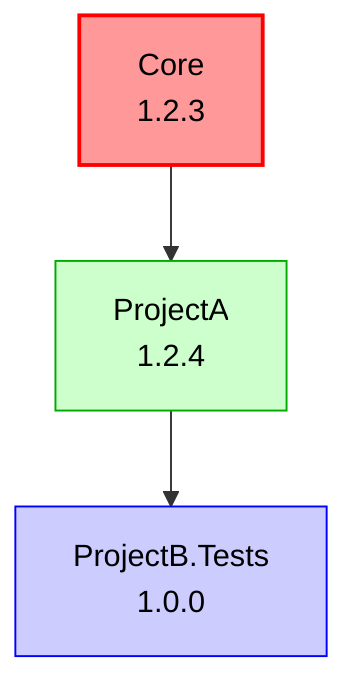
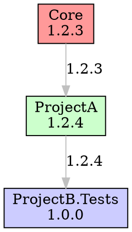

# Mister.Version


A sophisticated automatic versioning system for .NET monorepos built on MSBuild with enhanced support for development workflows and feature branches. Mister.Version (MR Version → MonoRepo Version) provides intelligent, change-based versioning that increases version numbers only when actual changes are detected in a project or its dependencies.

## ✨ What's New in v2.3.0

- **🎯 Conventional Commits Support**: Automatic semantic version bump detection based on commit message conventions (BREAKING CHANGE → major, feat → minor, fix → patch)
- **🏗️ Refactored Architecture**: Shared core library between MSBuild task and CLI tool
- **🔧 Dev Branch Support**: Development branches now increment patch versions like main branches
- **📊 Enhanced Feature Branches**: Feature branches include commit height in versioning (e.g., `v3.0.4-feature.1-{git-hash}`)
- **📄 JSON Reporting**: Full JSON report generation capability
- **🎯 Improved Change Detection**: Better detection of dependency changes and package updates
- **🧪 Enhanced Testing**: Comprehensive test coverage for core functionality
- **📊 Dependency Graph Visualization**: Generate visual dependency graphs in Mermaid, DOT, and ASCII formats

## Architecture

The solution is now structured with a shared core library:

```
Mister.Version.Core/          # Shared versioning logic
├── Models/                   # Data models and enums
├── Services/                 # Core services (Git, Versioning, Reporting)
└── Mister.Version.Core.csproj

Mister.Version/               # MSBuild task
├── MonoRepoVersionTask.cs    # MSBuild integration
└── Mister.Version.csproj

Mister.Version.CLI/           # Command-line tool
├── Program.cs                # CLI interface
└── Mister.Version.CLI.csproj
```

## Features

- **Conventional Commits Support**: ✨ **NEW** - Intelligent semantic versioning based on commit message conventions
- **Change-Based Versioning**: Version numbers only increment when actual code changes are detected
- **Dependency-Aware**: Automatically bumps versions when dependencies change
- **Enhanced Branch Support**: Different versioning strategies for main, dev, release, and feature branches
- **Feature Branch Commit Height**: Feature branches include commit count for better traceability
- **Package Lock Detection**: Detects changes in dependencies via packages.lock.json
- **Project Type Filtering**: Skip versioning for test projects and non-packable projects
- **Multiple Output Formats**: Text, JSON, CSV, and dependency graph reporting
- **MSBuild Integration**: Seamlessly integrates with your build process
- **Zero-Commit Approach**: No need to commit version changes to your repo
- **Customizable**: Extensive configuration options

## How It Works

MonoRepo Versioning uses Git history to intelligently determine when to increment versions. At build time, it:

1. Identifies the current branch type (main, dev, release, feature)
2. Determines the base version from tags and branch context
3. Checks for changes in the project and its dependencies
4. Applies appropriate versioning rules based on context
5. Injects the calculated version into MSBuild properties

### Enhanced Versioning Rules

- **Main Branch**: Commits to main increment the patch version by default (8.2.0 → 8.2.1)
  - With conventional commits enabled: Analyzes commit messages to determine bump type
- **Dev Branch**: ✨ **NEW** - Dev branches also increment patch versions (8.2.0 → 8.2.1)
  - With conventional commits enabled: Analyzes commit messages to determine bump type
- **Release Branches**: Patch increments for changes in the branch (7.3.0 → 7.3.2)
- **Feature Branches**: ✨ **ENHANCED** - Include commit height and hash (8.2.0-feature-name.3-abc1234)

### Conventional Commits for Semantic Versioning

✨ **NEW** - Mister.Version now supports automatic semantic version bump detection based on commit message conventions. When enabled, it analyzes commit messages to intelligently determine whether to bump major, minor, or patch versions.

#### How It Works

When conventional commits are enabled, the tool analyzes commit messages since the last version tag:

```bash
# These commits trigger MAJOR version bumps (1.0.0 → 2.0.0)
git commit -m "feat!: remove deprecated API"
git commit -m "fix: resolve bug

BREAKING CHANGE: The authentication flow has changed."

# These commits trigger MINOR version bumps (1.0.0 → 1.1.0)
git commit -m "feat: add new dashboard feature"
git commit -m "feature: implement user profiles"

# These commits trigger PATCH version bumps (1.0.0 → 1.0.1)
git commit -m "fix: resolve login bug"
git commit -m "bugfix: patch security issue"
git commit -m "perf: optimize database queries"
git commit -m "refactor: clean up authentication code"

# These commits are IGNORED for versioning
git commit -m "chore: update dependencies"
git commit -m "docs: update README"
git commit -m "style: format code"
git commit -m "test: add unit tests"
git commit -m "ci: update pipeline"
```

#### Commit Message Format

The tool supports the Angular conventional commits specification:

```
<type>[optional scope][optional !]: <description>

[optional body]

[optional footer(s)]
```

**Examples:**
- `feat: add user authentication` → Minor version bump
- `feat(api): add pagination support` → Minor version bump (with scope)
- `fix: resolve memory leak` → Patch version bump
- `feat!: redesign API` → Major version bump (breaking change indicator)
- `fix: resolve bug\n\nBREAKING CHANGE: API changed` → Major version bump (breaking change footer)

#### Default Patterns

| Bump Type | Default Patterns | Example |
|-----------|-----------------|---------|
| **Major** | `BREAKING CHANGE:`, `!:` | `feat!: remove old API` |
| **Minor** | `feat:`, `feature:` | `feat: add dashboard` |
| **Patch** | `fix:`, `bugfix:`, `perf:`, `refactor:` | `fix: resolve bug` |
| **None** | `chore:`, `docs:`, `style:`, `test:`, `ci:` | `chore: update deps` |

#### Priority Rules

When multiple commits exist, the highest priority bump type wins:
1. **Major** (breaking changes) takes precedence over everything
2. **Minor** (features) takes precedence over patch
3. **Patch** (fixes) is the baseline
4. **None** (ignored commits) doesn't affect versioning

**Example:** If you have commits `fix: bug`, `feat: feature`, and `feat!: breaking`, the result is a **major** version bump.

#### CLI Output

The CLI tool shows detailed analysis when conventional commits are enabled:

```bash
$ mr-version version -p src/MyProject/MyProject.csproj -d

Version: 2.0.0
Previous Version: 1.2.3
Version Changed: Yes
Change Reason: Main branch: Incrementing major version (breaking change detected)

Conventional Commits Analysis: Enabled
Detected Bump Type: Major

Analyzed Commits:
  Major (1):
    - abc1234: feat!: redesign authentication API
      Breaking change detected (! indicator)

  Minor (2):
    - def5678: feat: add user profiles
    - ghi9012: feature: implement dashboard

  Patch (3):
    - jkl3456: fix: resolve login bug
    - mno7890: perf: optimize queries
    - pqr1234: refactor: clean up code

  Ignored (2):
    - stu5678: chore: update dependencies
    - vwx9012: docs: update README
```

### Feature Branch Versioning

Feature branches now use a more sophisticated versioning scheme:

```
Format: {base-version}-{branch-name}.{commit-height}-{git-hash}
Example: v3.0.4-feature.1-abc1234
```

Where:
- `3.0.4` is the base version from the last tag
- `feature` is the normalized branch name
- `1` is the number of commits since the base tag
- `abc1234` is the short Git hash

## Getting Started

### Prerequisites

- .NET SDK 6.0+ (supports both .NET Framework 4.7.2 and .NET 8.0)
- Git installed and accessible in PATH
- A .NET solution using MSBuild

### Installation

#### Option 1: NuGet Package

```bash
dotnet add package Mister.Version --version 2.3.0
```

#### Option 2: CLI Tool

```bash
dotnet tool install --global Mister.Version.CLI --version 2.3.0
```

### Basic Setup

1. Add the targets file reference to each project that should use automatic versioning:

```xml
<Import Project="$(MSBuildThisFileDirectory)..\..\build\Mister.Version.targets" />
```

2. Create an initial version tag for your repository:

```bash
git tag v1.0.0
```

3. Build your solution:

```bash
dotnet build
```

The tool will automatically calculate and apply versions to your assemblies and packages.

### Quick Start: Enable Conventional Commits

To enable automatic semantic versioning based on commit messages:

1. Add to your project file or Directory.Build.props:

```xml
<PropertyGroup>
  <MonoRepoConventionalCommitsEnabled>true</MonoRepoConventionalCommitsEnabled>
</PropertyGroup>
```

2. Use conventional commit messages:

```bash
# Minor version bump (new feature)
git commit -m "feat: add user authentication"

# Patch version bump (bug fix)
git commit -m "fix: resolve login issue"

# Major version bump (breaking change)
git commit -m "feat!: redesign API"
```

3. Build and see semantic versioning in action:

```bash
dotnet build
```

The version will be automatically incremented based on your commit types!

## CLI Usage

The CLI tool provides comprehensive reporting and single-project version calculation:

### Generate Version Report

```bash
# Generate a text report
mr-version report

# Generate JSON report
mr-version report -o json -f versions.json

# Include test projects and detailed info
mr-version report --include-test-projects --include-commits

# Generate CSV for analysis
mr-version report -o csv -f report.csv

# Generate dependency graph
mr-version report -o graph

# Generate Mermaid graph for GitHub
mr-version report -o graph --graph-format mermaid

# Generate DOT graph for Graphviz
mr-version report -o graph --graph-format dot -f dependencies.dot

# Generate ASCII tree in console
mr-version report -o graph --graph-format ascii

# Show only changed projects in graph
mr-version report -o graph --changed-only
```

#### CLI Options

| Option | Description | Default |
|--------|-------------|---------|
| `-r, --repo` | Repository root path | Current directory |
| `-p, --project-dir` | Projects directory | Repository root |
| `-o, --output` | Output format (text, json, csv, graph) | `text` |
| `-f, --file` | Output file path | Console |
| `-b, --branch` | Branch to analyze | Current branch |
| `--include-commits` | Include commit information | `true` |
| `--include-dependencies` | Include dependency information | `true` |
| `--include-test-projects` | Include test projects | `false` |
| `--include-non-packable` | Include non-packable projects | `false` |
| `--graph-format` | Graph format (mermaid, dot, ascii) | `mermaid` |
| `--show-versions` | Show version numbers in graph nodes | `true` |
| `--changed-only` | Show only projects with changes | `false` |

### Calculate Single Project Version

```bash
# Get version for specific project
mr-version version -p src/MyProject/MyProject.csproj

# Detailed output with reasoning
mr-version version -p src/MyProject/MyProject.csproj -d

# JSON output for automation
mr-version version -p src/MyProject/MyProject.csproj -j
```

## Report Formats

### Dependency Graph Visualization

MonoRepo Versioning can generate visual dependency graphs in multiple formats to help understand project relationships and dependencies:

#### Mermaid Format (GitHub Compatible)

Perfect for GitHub markdown files and documentation:

```bash
mr-version report -o graph --graph-format mermaid
```



#### DOT Format (Graphviz)

For professional diagrams and complex visualizations:

```bash
mr-version report -o graph --graph-format dot -f dependencies.dot
```



#### ASCII Format (Console)

For quick terminal viewing:

```bash
mr-version report -o graph --graph-format ascii
```

```
=== MonoRepo Dependency Graph ===

🔄 Core (1.2.3) [CHANGED]
  📦 ProjectA (1.2.4)
    🧪 ProjectB.Tests (1.0.0)
```

#### Graph Features

- **Visual Project Status**: 
  - 🔄 Changed projects (red in Mermaid/DOT)
  - 📦 Packable projects (green in Mermaid/DOT)
  - 🧪 Test projects (blue in Mermaid/DOT)
  - 📁 Other projects (gray in Mermaid/DOT)

- **Version Information**: Show calculated versions on nodes (`--show-versions`)
- **Dependency Edges**: Visual connections showing project dependencies
- **Filtering Options**: Show only changed projects (`--changed-only`)

### JSON Report Example

```json
{
  "repository": "/path/to/repo",
  "branch": "feature/new-feature",
  "branchType": "Feature",
  "globalVersion": "3.0.4",
  "generatedAt": "2024-01-15T10:30:00Z",
  "totalProjects": 5,
  "projectsWithChanges": 2,
  "projects": [
    {
      "name": "Core",
      "path": "src/Core/Core.csproj",
      "version": {
        "version": "3.0.4-feature.1-abc1234",
        "semVer": {
          "major": 3,
          "minor": 0,
          "patch": 4,
          "preRelease": "feature.1-abc1234"
        },
        "versionChanged": true,
        "changeReason": "Feature branch: Using pre-release version with commit height 1",
        "commitHeight": 1,
        "branchType": "Feature"
      },
      "dependencies": {
        "direct": [],
        "all": []
      },
      "isTestProject": false,
      "isPackable": true
    }
  ]
}
```

## Configuration

Mister.Version can be configured using MSBuild properties or a YAML configuration file.

### MSBuild Properties

| Property | Description | Default |
|----------|-------------|---------|
| `MonoRepoVersioningEnabled` | Enable/disable automatic versioning | `true` |
| `MonoRepoRoot` | Starting directory for Git repository discovery | `$(ProjectDir)` |
| `MonoRepoTagPrefix` | Prefix for version tags | `v` |
| `MonoRepoUpdateProjectFile` | Update project files with versions | `false` |
| `MonoRepoDebug` | Enable debug logging | `false` |
| `MonoRepoExtraDebug` | Enable extra debug logging | `false` |
| `MonoRepoSkipTestProjects` | Skip versioning for test projects | `true` |
| `MonoRepoSkipNonPackableProjects` | Skip versioning for non-packable projects | `true` |
| `MonoRepoPrereleaseType` | Prerelease type for main/dev branches (none, alpha, beta, rc) | `none` |
| `MonoRepoConfigFile` | Path to YAML configuration file | Empty |
| `ForceVersion` | Force a specific version | Empty |
| `MonoRepoConventionalCommitsEnabled` | ✨ Enable conventional commits analysis for semantic versioning | `false` |
| `MonoRepoMajorPatterns` | ✨ Semicolon-separated patterns for major version bumps | `BREAKING CHANGE:;!:` |
| `MonoRepoMinorPatterns` | ✨ Semicolon-separated patterns for minor version bumps | `feat:;feature:` |
| `MonoRepoPatchPatterns` | ✨ Semicolon-separated patterns for patch version bumps | `fix:;bugfix:;perf:;refactor:` |
| `MonoRepoIgnorePatterns` | ✨ Semicolon-separated patterns to ignore for versioning | `chore:;docs:;style:;test:;ci:` |

#### Example MSBuild Configuration

```xml
<PropertyGroup>
  <MonoRepoDebug>true</MonoRepoDebug>
  <MonoRepoTagPrefix>release-</MonoRepoTagPrefix>
  <MonoRepoPrereleaseType>beta</MonoRepoPrereleaseType>

  <!-- Enable conventional commits for semantic versioning -->
  <MonoRepoConventionalCommitsEnabled>true</MonoRepoConventionalCommitsEnabled>
</PropertyGroup>
```

#### Example: Custom Conventional Commit Patterns

```xml
<PropertyGroup>
  <!-- Enable conventional commits -->
  <MonoRepoConventionalCommitsEnabled>true</MonoRepoConventionalCommitsEnabled>

  <!-- Custom patterns (semicolon-separated) -->
  <MonoRepoMajorPatterns>BREAKING CHANGE:;breaking:;MAJOR:</MonoRepoMajorPatterns>
  <MonoRepoMinorPatterns>feat:;feature:;add:</MonoRepoMinorPatterns>
  <MonoRepoPatchPatterns>fix:;bugfix:;patch:;perf:;refactor:</MonoRepoPatchPatterns>
  <MonoRepoIgnorePatterns>chore:;docs:;style:;test:;ci:;wip:</MonoRepoIgnorePatterns>
</PropertyGroup>
```

### YAML Configuration

For more complex scenarios, use a YAML configuration file with project-specific overrides.

#### Example YAML Configuration

Create a `mr-version.yml` file in your repository root:

```yaml
# Base global version used as fallback when no tags or versions are found
baseVersion: "8.2.0"

# Global settings
prereleaseType: none  # Options: none, alpha, beta, rc
tagPrefix: v
skipTestProjects: true
skipNonPackableProjects: true

# ✨ Conventional commits configuration
commitConventions:
  enabled: true
  majorPatterns:
    - "BREAKING CHANGE:"
    - "!:"
    - "breaking:"
  minorPatterns:
    - "feat:"
    - "feature:"
  patchPatterns:
    - "fix:"
    - "bugfix:"
    - "perf:"
    - "refactor:"
  ignorePatterns:
    - "chore:"
    - "docs:"
    - "style:"
    - "test:"
    - "ci:"

# Project-specific overrides
projects:
  # Force a specific project to use alpha prereleases
  MyLibrary:
    prereleaseType: alpha

  # Pin a specific project to a fixed version
  LegacyProject:
    forceVersion: 1.0.0

  # Project that should use beta prereleases
  ExperimentalFeature:
    prereleaseType: beta
```

Reference the config file in your project:

```xml
<PropertyGroup>
  <MonoRepoConfigFile>$(MSBuildProjectDirectory)/../mr-version.yml</MonoRepoConfigFile>
</PropertyGroup>
```

Or set it globally in a Directory.Build.props file:

```xml
<Project>
  <PropertyGroup>
    <MonoRepoConfigFile>$(MSBuildThisFileDirectory)/mr-version.yml</MonoRepoConfigFile>
  </PropertyGroup>
</Project>
```

### Configuration Precedence

Configuration values are applied in this order (later values override earlier ones):

1. Default values in Mister.Version.props
2. MSBuild properties in project files
3. Global settings from YAML configuration file
4. Project-specific settings from YAML configuration file

### Prerelease Types

- `none` - No prerelease suffix (e.g., `1.0.0`)
- `alpha` - Alpha prerelease (e.g., `1.0.0-alpha.1`)
- `beta` - Beta prerelease (e.g., `1.0.0-beta.1`)
- `rc` - Release candidate (e.g., `1.0.0-rc.1`)

## Advanced Features

### Global vs. Project-Specific Tags

MonoRepo Versioning supports two types of tags:

1. **Project-specific tags** (default): Apply to individual projects
   - Format: `v1.2.3-projectname` (e.g., `v1.2.3-core`)
   - Used for patch and minor releases
   - Allows independent versioning of projects in the monorepo

2. **Global tags**: Apply to the entire repository
   - Format: `v1.0.0` (no project suffix)
   - Created automatically for major version releases (x.0.0)
   - Used to mark significant milestones across the entire monorepo

The system automatically creates project-specific tags by default, and only creates global tags when releasing a new major version (e.g., going from v1.x.x to v2.0.0).

### Enhanced Change Detection

The system examines multiple sources for changes:

- Direct project file modifications
- Project dependency changes
- Package dependency updates (packages.lock.json)
- Transitive dependency version changes

### Feature Branch Workflow

Feature branches provide detailed versioning for development workflows:

```bash
# Start feature branch from main (v3.0.4)
git checkout -b feature/awesome-feature

# Make changes and commit
git add .
git commit -m "Add awesome feature"

# Build shows: v3.0.4-awesome-feature.1-abc1234
dotnet build

# More commits increase the height
git commit -m "Fix awesome feature"
# Build shows: v3.0.4-awesome-feature.2-def5678
```

## CI/CD Integration

### GitHub Actions Example

```yaml
name: Build and Version
on: [push, pull_request]

jobs:
  build:
    runs-on: ubuntu-latest
    steps:
    - uses: actions/checkout@v4
      with:
        fetch-depth: 0  # Required for git history
    
    - name: Setup .NET
      uses: actions/setup-dotnet@v4
      with:
        dotnet-version: '8.0.x'
    
    - name: Install CLI tool
      run: dotnet tool install --global Mister.Version.CLI
    
    - name: Generate version report
      run: mr-version report -o json -f version-report.json
    
    - name: Build with versioning
      run: dotnet build --configuration Release
    
    - name: Upload version report
      uses: actions/upload-artifact@v4
      with:
        name: version-report
        path: version-report.json
```

## Debugging and Troubleshooting

Enable debug logging to see detailed information about the versioning process:

```bash
dotnet build /p:MonoRepoVersionDebug=true -v:n
```

For even more details:

```bash
dotnet build /p:MonoRepoVersionExtraDebug=true -v:n
```

This will display:
- Branch type detection
- Tag analysis and selection
- Change detection results
- Dependency graph analysis
- Feature branch commit height calculation
- Detailed reasoning for version decisions

### Common Issues

1. **Versions not incrementing**: Check that changes were detected in the project files
2. **Wrong version on feature branch**: Verify branch naming and check for changes
3. **Feature branch missing commit height**: Ensure there's a base tag to calculate from
4. **Package has wrong version**: Ensure MSBuild properties are correctly set

## Migration from v1.0.x

The new architecture is backward compatible, but you may want to take advantage of new features:

1. **Dev branches**: No changes needed - dev branches will now increment patch versions
2. **Feature branch enhancements**: Feature branches automatically get commit height
3. **JSON reporting**: Use the CLI tool with `-o json` for structured reports
4. **Enhanced change detection**: Automatic - better dependency change detection

## Contributing

Contributions are welcome! The new modular architecture makes it easier to contribute:

1. **Core Logic**: Add features to `Mister.Version.Core`
2. **MSBuild Integration**: Enhance the MSBuild task
3. **CLI Features**: Extend the command-line interface
4. **Testing**: Add tests for core functionality

## License

This project is licensed under the MIT License - see the LICENSE file for details.

---

**Mister.Version** - Making monorepo versioning simple, intelligent, and developer-friendly.